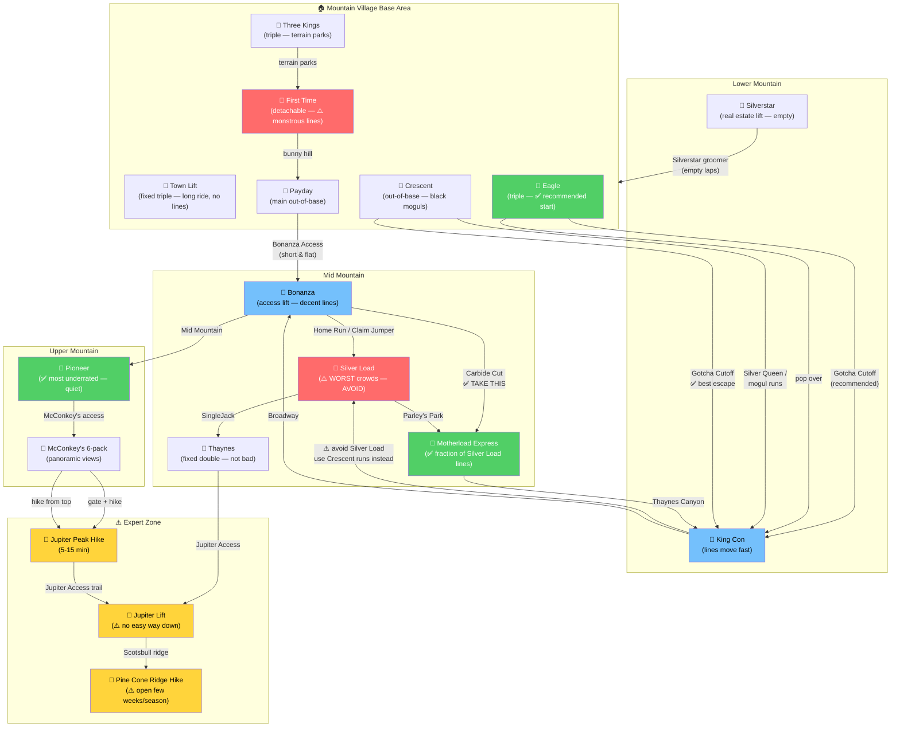
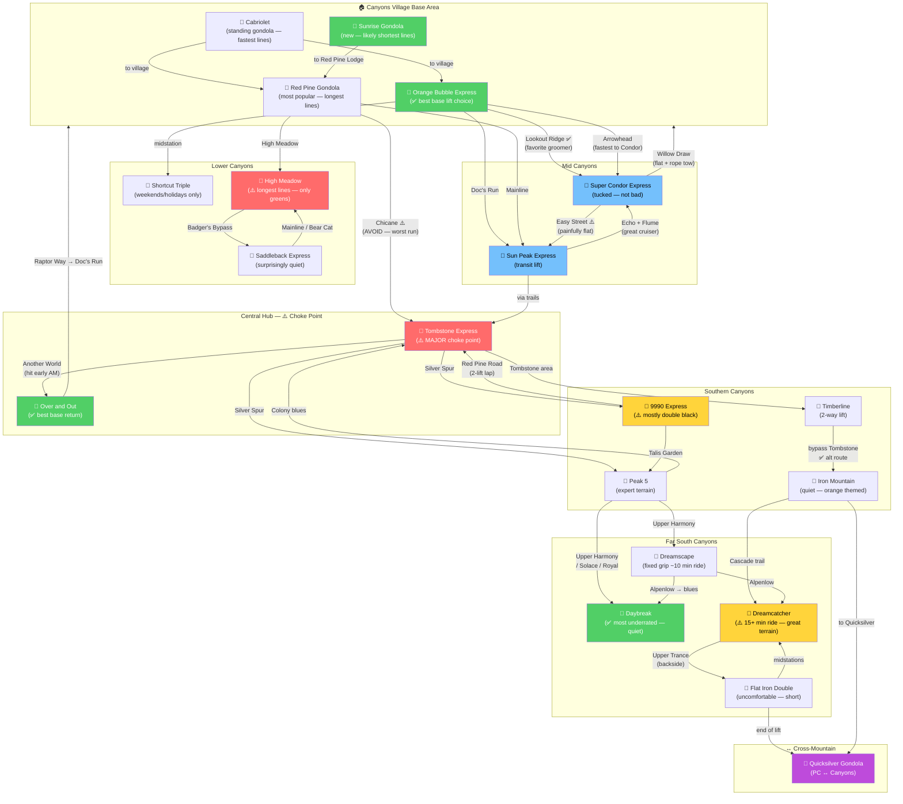

# Park City — Lift Navigation Graphs

> Color key: 🟢 Green = recommended/quiet | 🔴 Red = avoid/crowded | 🟡 Yellow = expert/caution | 🔵 Blue = standard | 🟣 Purple = cross-mountain connection

---

## 1. Mountain Village Side — Lift Flow

---

## 2. Canyons Side — Lift Flow

---

## 3. Cross-Mountain Connections

```mermaid
flowchart LR
    subgraph MV["🏠 Mountain Village"]
        MV_BASE["Base Area\n(Payday / Eagle / Crescent)"]
        MV_BZ["Bonanza"]
        MV_PI["Pioneer"]
        MV_MK["McConkey's"]
        MV_JP["Jupiter"]
    end

    subgraph LINK["🔗 Connections"]
        QS_MID["Quicksilver\nMidstation"]
        QS["🚡 Quicksilver Gondola"]
        BUS["🚌 Free Bus\n(High Valley Transit)"]
        PCR["🥾 Pine Cone Ridge\n(hike from QS midstation)"]
    end

    subgraph CV["🏠 Canyons Village"]
        CV_BASE["Base Area\n(OBX / Red Pine / Sunrise)"]
        CV_TL["Timberline"]
        CV_IM["Iron Mountain"]
        CV_FI["Flat Iron"]
        CV_DC["Dreamcatcher"]
        CV_TS["Tombstone"]
    end

    %% Mountain Village path to Quicksilver
    MV_BASE -->|"Payday → Bonanza Access"| MV_BZ
    MV_BZ -->|"Mid Mountain"| MV_PI
    MV_PI --> MV_MK
    MV_MK -->|"hike"| MV_JP
    MV_JP -->|"Scotsbull → hike"| PCR

    %% Quicksilver connections
    MV_BZ -->|"Silver Load / Motherload\n→ Thaynes Canyon"| QS
    QS_MID -->|"Blaze's Way / Highway\n(blue cruisers)"| CV_DC
    QS -->|"ride full length"| CV_TS
    PCR -->|"Limelight access"| QS_MID

    %% Canyons path to Quicksilver
    CV_BASE -->|"OBX / Red Pine"| CV_TS
    CV_TS --> CV_TL
    CV_TL -->|"✅ fastest route\nto PC side"| CV_IM
    CV_IM --> QS
    CV_DC -->|"Upper Trance"| CV_FI
    CV_FI --> QS

    %% Bus
    MV_BASE <-->|"free bus\nboth directions"| BUS
    BUS <-->|"free bus\nboth directions"| CV_BASE

    %% Styling
    style QS fill:#be4bdb,color:#fff
    style QS_MID fill:#be4bdb,color:#fff
    style BUS fill:#51cf66,color:#fff
    style PCR fill:#ffd43b,color:#000
```

