# Park City — Lift Navigation Graphs

> Color key: 🟢 Green = recommended/quiet | 🔴 Red = avoid/crowded | 🟡 Yellow = expert/caution | 🔵 Blue = standard | 🟣 Purple = cross-mountain connection

---

## 1. Mountain Village Side — Lift Flow

```mermaid
flowchart TD
    subgraph BASE["🏠 Mountain Village Base Area"]
        TL["🚡 Town Lift\n(fixed triple — long ride, no lines)"]
        FT["🚡 First Time\n(detachable — ⚠️ monstrous lines)"]
        TK["🚡 Three Kings\n(triple — terrain parks)"]
        EG["🚡 Eagle\n(triple — ✅ recommended start)"]
        PD["🚡 Payday\n(main out-of-base)"]
        CR["🚡 Crescent\n(out-of-base — black moguls)"]
    end

    subgraph LOWER["Lower Mountain"]
        KC["🚡 King Con\n(lines move fast)"]
        SS["🚡 Silverstar\n(real estate lift — empty)"]
    end

    subgraph MID["Mid Mountain"]
        BZ["🚡 Bonanza\n(access lift — decent lines)"]
        SL["🚡 Silver Load\n(⚠️ WORST crowds — AVOID)"]
        ML["🚡 Motherload Express\n(✅ fraction of Silver Load lines)"]
        TH["🚡 Thaynes\n(fixed double — not bad)"]
    end

    subgraph UPPER["Upper Mountain"]
        PI["🚡 Pioneer\n(✅ most underrated — quiet)"]
        MK["🚡 McConkey's 6-pack\n(panoramic views)"]
    end

    subgraph EXPERT["⚠️ Expert Zone"]
        JP["🚡 Jupiter Lift\n(⚠️ no easy way down)"]
        JH["🥾 Jupiter Peak Hike\n(5-15 min)"]
        PC["🥾 Pine Cone Ridge Hike\n(⚠️ open few weeks/season)"]
    end

    %% Base connections
    EG -->|"Gotcha Cutoff\n(recommended)"| KC
    EG -->|"pop over"| KC
    FT -->|"bunny hill"| PD
    TK -->|"terrain parks"| FT
    PD -->|"Bonanza Access\n(short & flat)"| BZ
    CR -->|"Silver Queen /\nmogul runs"| KC
    CR -->|"Gotcha Cutoff\n✅ best escape"| KC

    %% Lower to Mid
    KC -->|"⚠️ avoid Silver Load\nuse Crescent runs instead"| SL
    KC -->|"Broadway"| BZ
    SS -->|"Silverstar groomer\n(empty laps)"| BASE

    %% Mid connections
    BZ -->|"Home Run / Claim Jumper"| SL
    BZ -->|"Carbide Cut\n✅ TAKE THIS"| ML
    BZ -->|"Mid Mountain"| PI
    SL -->|"Parley's Park"| ML
    SL -->|"SingleJack"| TH
    ML -->|"Thaynes Canyon"| KC
    TH -->|"Jupiter Access"| JP

    %% Upper connections
    PI -->|"McConkey's access"| MK
    MK -->|"gate + hike"| JH
    JH -->|"Jupiter Access trail"| JP
    JP -->|"Scotsbull ridge"| PC
    MK -->|"hike from top"| JH

    %% Styling
    style SL fill:#ff6b6b,color:#fff
    style ML fill:#51cf66,color:#fff
    style PI fill:#51cf66,color:#fff
    style JP fill:#ffd43b,color:#000
    style PC fill:#ffd43b,color:#000
    style JH fill:#ffd43b,color:#000
    style FT fill:#ff6b6b,color:#fff
    style EG fill:#51cf66,color:#fff
    style BZ fill:#74c0fc,color:#000
    style KC fill:#74c0fc,color:#000
```

---

## 2. Canyons Side — Lift Flow

```mermaid
flowchart TD
    subgraph BASE["🏠 Canyons Village Base Area"]
        CB["🚡 Cabriolet\n(standing gondola — fastest lines)"]
        OBX["🚡 Orange Bubble Express\n(✅ best base lift choice)"]
        RPG["🚡 Red Pine Gondola\n(most popular — longest lines)"]
        SRG["🚡 Sunrise Gondola\n(new — likely shortest lines)"]
    end

    subgraph LOWER_C["Lower Canyons"]
        SC["🚡 Shortcut Triple\n(weekends/holidays only)"]
        HM["🚡 High Meadow\n(⚠️ longest lines — only greens)"]
        SB["🚡 Saddleback Express\n(surprisingly quiet)"]
    end

    subgraph MID_C["Mid Canyons"]
        SP["🚡 Sun Peak Express\n(transit lift)"]
        CD["🚡 Super Condor Express\n(tucked — not bad)"]
    end

    subgraph CENTRAL["Central Hub — ⚠️ Choke Point"]
        TS["🚡 Tombstone Express\n(⚠️ MAJOR choke point)"]
        OO["🚡 Over and Out\n(✅ best base return)"]
    end

    subgraph SOUTH["Southern Canyons"]
        TL2["🚡 Timberline\n(2-way lift)"]
        IM["🚡 Iron Mountain\n(quiet — orange themed)"]
        P5["🚡 Peak 5\n(expert terrain)"]
        N9["🚡 9990 Express\n(⚠️ mostly double black)"]
    end

    subgraph FAR_SOUTH["Far South Canyons"]
        DB["🚡 Daybreak\n(✅ most underrated — quiet)"]
        DS["🚡 Dreamscape\n(fixed grip ~10 min ride)"]
        DC["🚡 Dreamcatcher\n(⚠️ 15+ min ride — great terrain)"]
        FI["🚡 Flat Iron Double\n(uncomfortable — short)"]
    end

    subgraph CROSS["↔️ Cross-Mountain"]
        QS["🚡 Quicksilver Gondola\n(PC ↔ Canyons)"]
    end

    %% Base flow
    CB -->|"to village"| OBX
    CB -->|"to village"| RPG
    SRG -->|"to Red Pine Lodge"| RPG
    OBX -->|"midstation"| SC

    %% Lower connections
    OBX -->|"Lookout Ridge ✅\n(favorite groomer)"| CD
    OBX -->|"Arrowhead\n(fastest to Condor)"| CD
    OBX -->|"Doc's Run"| SP
    RPG -->|"Mainline"| SP
    RPG -->|"High Meadow"| HM
    HM -->|"Badger's Bypass"| SB
    SB -->|"Mainline / Bear Cat"| HM

    %% Mid connections
    SP -->|"Echo + Flume\n(great cruiser)"| CD
    CD -->|"Easy Street ⚠️\n(painfully flat)"| SP
    CD -->|"Willow Draw\n(flat + rope tow)"| BASE

    %% Central hub
    RPG -->|"Chicane ⚠️\n(AVOID — worst run)"| TS
    SP -->|"via trails"| TS
    TS -->|"Silver Spur"| P5
    TS -->|"Silver Spur"| N9
    TS -->|"Another World\n(hit early AM)"| OO
    OO -->|"Raptor Way → Doc's Run"| BASE

    %% South connections
    TS -->|"Tombstone area"| TL2
    TL2 -->|"bypass Tombstone\n✅ alt route"| IM
    IM -->|"Cascade trail"| DC
    P5 -->|"Colony blues"| TS
    P5 -->|"Upper Harmony\n/ Solace / Royal"| DB
    P5 -->|"Upper Harmony"| DS
    N9 -->|"Red Pine Road\n(2-lift lap)"| TS
    N9 -->|"Talis Garden"| P5

    %% Far South
    DS -->|"Alpenlow"| DC
    DS -->|"Alpenlow → blues"| DB
    DC -->|"Upper Trance\n(backside)"| FI
    FI -->|"midstations"| DC
    FI -->|"end of lift"| QS

    %% Cross-mountain
    IM -->|"to Quicksilver"| QS

    %% Styling
    style TS fill:#ff6b6b,color:#fff
    style HM fill:#ff6b6b,color:#fff
    style OBX fill:#51cf66,color:#fff
    style DB fill:#51cf66,color:#fff
    style OO fill:#51cf66,color:#fff
    style N9 fill:#ffd43b,color:#000
    style DC fill:#ffd43b,color:#000
    style QS fill:#be4bdb,color:#fff
    style SRG fill:#51cf66,color:#fff
    style CD fill:#74c0fc,color:#000
    style SP fill:#74c0fc,color:#000
```

---

## 3. Cross-Mountain Connections

```mermaid
flowchart LR
    subgraph MV["🏠 Mountain Village"]
        MV_BASE["Base Area\n(Payday / Eagle / Crescent)"]
        MV_BZ["Bonanza"]
        MV_PI["Pioneer"]
        MV_MK["McConkey's"]
        MV_JP["Jupiter"]
    end

    subgraph LINK["🔗 Connections"]
        QS_MID["Quicksilver\nMidstation"]
        QS["🚡 Quicksilver Gondola"]
        BUS["🚌 Free Bus\n(High Valley Transit)"]
        PCR["🥾 Pine Cone Ridge\n(hike from QS midstation)"]
    end

    subgraph CV["🏠 Canyons Village"]
        CV_BASE["Base Area\n(OBX / Red Pine / Sunrise)"]
        CV_TL["Timberline"]
        CV_IM["Iron Mountain"]
        CV_FI["Flat Iron"]
        CV_DC["Dreamcatcher"]
        CV_TS["Tombstone"]
    end

    %% Mountain Village path to Quicksilver
    MV_BASE -->|"Payday → Bonanza Access"| MV_BZ
    MV_BZ -->|"Mid Mountain"| MV_PI
    MV_PI --> MV_MK
    MV_MK -->|"hike"| MV_JP
    MV_JP -->|"Scotsbull → hike"| PCR

    %% Quicksilver connections
    MV_BZ -->|"Silver Load / Motherload\n→ Thaynes Canyon"| QS
    QS_MID -->|"Blaze's Way / Highway\n(blue cruisers)"| CV_DC
    QS -->|"ride full length"| CV_TS
    PCR -->|"Limelight access"| QS_MID

    %% Canyons path to Quicksilver
    CV_BASE -->|"OBX / Red Pine"| CV_TS
    CV_TS --> CV_TL
    CV_TL -->|"✅ fastest route\nto PC side"| CV_IM
    CV_IM --> QS
    CV_DC -->|"Upper Trance"| CV_FI
    CV_FI --> QS

    %% Bus
    MV_BASE <-->|"free bus\nboth directions"| BUS
    BUS <-->|"free bus\nboth directions"| CV_BASE

    %% Styling
    style QS fill:#be4bdb,color:#fff
    style QS_MID fill:#be4bdb,color:#fff
    style BUS fill:#51cf66,color:#fff
    style PCR fill:#ffd43b,color:#000
```

